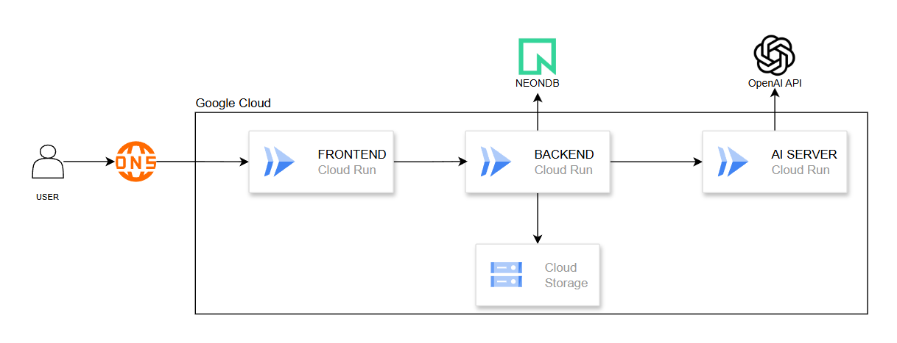

  

# NYANG AI

## 1. 프로젝트 개요
NYANG AI는 AI 기반 학습 경험 개선을 위한 LMS 분석 서버입니다.  
강의 영상을 단순히 재생하는 데 그치지 않고, 영상에서 추출한 STT 자막과 학습자의 시청 로그를 함께 분석해 학습자와 강사 모두에게 더 나은 학습 경험을 제공하는 것을 목표로 합니다.

이 서버는 강의 영상으로부터 전체 자막과 세그먼트를 생성하고, 이를 바탕으로 강의 요약, 핵심 키워드 추출, Pre Analysis를 수행합니다. 또한 학습자의 실제 시청 로그를 기반으로 Aggregate Analysis를 수행하여, 강의 내용과 학습 행동 데이터를 함께 반영한 AI 인사이트를 제공합니다.

학습자에게는 퀴즈, 보충 설명, 복습 포인트를 제공하고, 강사에게는 실제 학습자가 어려움을 겪는 구간과 개선이 필요한 지점을 전달할 수 있도록 설계했습니다.

---

## 2. 목표
- 강의 영상으로부터 STT 자막 및 세그먼트 생성
- 강의 내용 요약 및 핵심 키워드 추출
- 강의 내용 기반 Pre Analysis 수행
- 학습자 시청 로그 기반 Aggregate Analysis 수행
- 학습자와 강사 모두에게 의미 있는 AI 기반 인사이트 제공
- LMS 백엔드와 연동 가능한 독립형 AI 분석 서버 구축

---

## 3. 기술 스택

### AI Server
- Python
- FastAPI
- Pydantic
- Uvicorn

### AI / Analysis
- STT Server
- LLM 기반 분석 서버
- LangGraph
- LangChain

### Media Processing
- FFmpeg
- FFprobe

### Infra
- Docker
- Google Cloud Run
- Google Cloud Storage

### Database / External
- PostgreSQL
- NeonDB

---

## 4. Architecture

  

NYANG AI는 Spring Boot Backend와 연동되는 독립형 AI 서버로, 강의 영상과 시청 로그를 입력받아 STT, 요약, Pre Analysis, Aggregate Analysis를 수행한 뒤 결과를 반환합니다.

Frontend  
↓  
Spring Boot Backend  
├── 강의 / 강좌 관리  
├── 영상 업로드 및 메타데이터 저장  
├── 시청 로그 수집 및 세션 집계  
├── 마지막 시청 위치 관리  
└── AI 서버 연동

Spring Boot Backend  
├─→ Database  
│   ├── 강의 정보 저장  
│   ├── 자막 / 세그먼트 저장  
│   ├── 시청 로그 및 세션 데이터 저장  
│   └── 분석 결과 저장  
│
└─→ NYANG AI  
├── 전체 자막 생성  
├── 세그먼트 생성  
├── 강의 요약 생성  
├── 핵심 키워드 추출  
├── Pre Analysis 수행  
└── Aggregate Analysis 수행

---

## 5. 디렉토리 구조

app/  
├── api/         # FastAPI 라우터 정의, 엔드포인트 요청/응답 연결  
├── core/        # 환경설정, 모델 클라이언트, 공통 설정 관리  
├── services/    # STT, 요약, pre/aggregate analysis 등 핵심 비즈니스 로직 처리  
├── schemas/     # 요청/응답 DTO, Pydantic 스키마 정의  
├── utils/       # 파일 처리, 시간 변환, 검증 함수 등 공통 유틸리티  
└── main.py      # FastAPI 앱 실행 진입점

---

## 6. 분석 종류

1. 영상 업로드
    - 사용자가 강의 영상 파일을 업로드합니다.

2. 음성 추출
    - 영상에서 음성 트랙을 분리합니다.

3. STT 수행
    - 음성을 텍스트로 변환하여 전체 자막을 생성합니다.

4. Segment 생성
    - 자막을 시간 단위 segment로 분할합니다.

5. Summary 생성
    - 전체 강의 내용을 요약하고 핵심 키워드를 추출합니다.

6. Pre Analysis 생성
    - 강의 내용 기반으로 퀴즈, 보충 설명, 강사 가이드를 생성합니다.

7. Aggregate Analysis 생성
    - 학습자의 시청 로그를 바탕으로 실제 어려움 구간과 학습 패턴을 분석합니다.

---

## 7. 엔드포인트

### 1) STT 변환 및 사전 분석
- `POST /api/stt/transcribe-and-pre-analyze`
- 영상 파일을 입력받아 전체 자막, 세그먼트, 요약 결과와 세그먼트를 기반으로 퀴즈와 강사 가이드를 반환합니다.

반환 데이터
- `language`: 영상 언어
- `duration_sec`: 영상 길이
- `full_text`: 영상 전체 STT 결과
- `segments`: 세그먼트 목록
    - `index`: 인덱스
    - `start`: 시작 시각
    - `end`: 종료 시각
    - `text`: 구간 텍스트
- `summarize`: 요약 결과
    - `summary_text`: 강의 요약 내용
    - `keywords`: 핵심 키워드 목록
- `analysis`: 분석 결과
    - `quizzes`: 퀴즈 목록
      - `quizInsertTimeSec`: 퀴즈 삽입 시간
      - `question`: 질문
      - `answer`: 답변
      - `explanation`: 해설
      - `supplementalDescription`: 보충 설명
    - `teacherGuides`: 강사 가이드 목록
        - `predictedDifficultSection`: 어려울 것으로 예상되는 구간
        - `predictedReason`: 해당 구간이 어려운 이유
        - `improvementSuggestion`: 강의 개선 제안

### 3) Aggregate Analysis(로그 분석)
- `POST /api/analysis/aggregate`
- 시청 로그를 기반으로 학습자 행동 패턴과 어려움 구간을 집계 분석합니다.

반환 데이터
- `quizzes`: 퀴즈 목록
    - `quizInsertTimeSec`: 퀴즈 삽입 시간
    - `question`: 질문
    - `answer`: 답변
    - `explanation`: 해설
    - `supplementalDescription`: 보충 설명
- `teacherGuides`: 강사 가이드 목록
    - `predictedDifficultSection`: 어려울 것으로 예상되는 구간
    - `predictedReason`: 해당 구간이 어려운 이유
    - `improvementSuggestion`: 강의 개선 제안

---

## 8. 실행 방법

### 1. 저장소 클론
git clone https://github.com/KIT-NYANG/kit_vibe_coding_ai.git

루트 디렉토리 이동

### 2. 의존성 설치
poetry install

### 3. 환경 변수 설정
`.env` 또는 설정 파일에 필요한 값을 추가합니다.

예시:
OPENAI_API_KEY=your_key  
LLM_MODEL=your_model  
SUMMARY_MODEL=your_summary_model  
STT_MODEL=your_stt_model

### 4. 서버 실행
poetry run uvicorn app.main:app --reload --host 0.0.0.0 --port 8001

### 5. API 문서 확인
Docs: http://localhost:8001/docs

---

## 9. 한 줄 소개
강의 내용과 실제 학습 행동 데이터를 함께 분석해 더 나은 학습 경험을 만드는 AI 기반 LMS 분석 서버입니다.